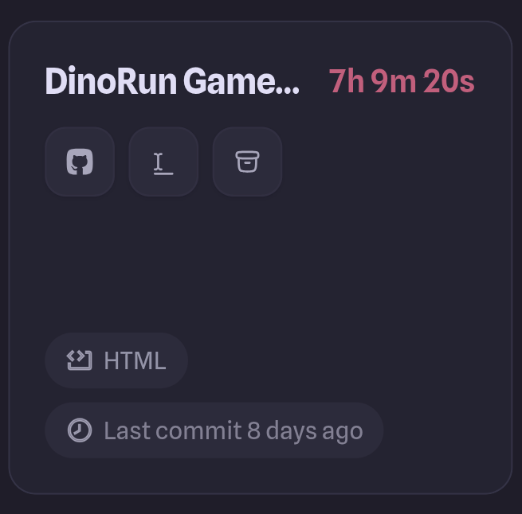
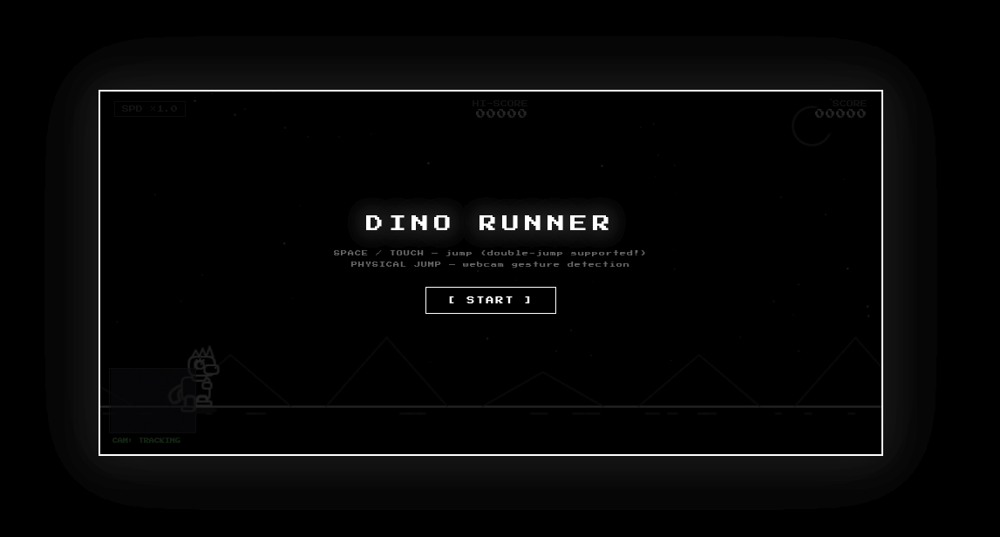
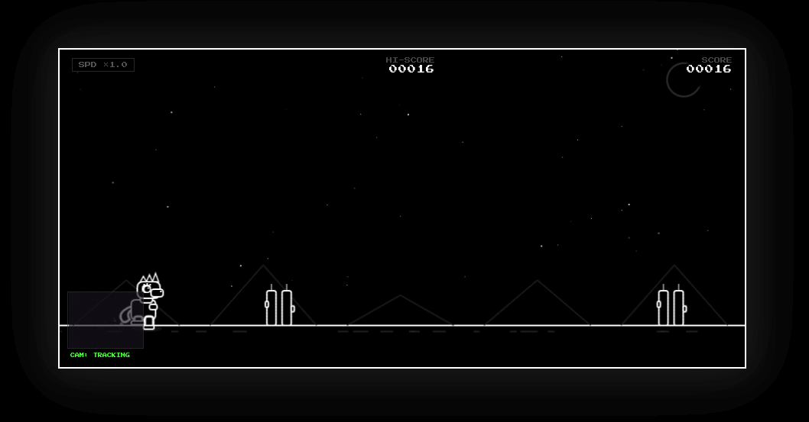

# Dino Vision Runner 

Hello!! I am Farwa Zafar i am 14-year-old from Pakistan and i am in 9 grade i love building websites with the help of coding and also exploring new technologies i also love engineering and IoT.My other hobbies are sketching and love to read books

## About the Project

This is a very fun and interactive game that I built using HTML, CSS, and JavaScript i got the game idea from the google chrome game when the internet is off and we are off line the game we often play a dinasour game who run constantly and also jump when danger things come like cactus plants and flying birds

*My Inspiration:*

In this game, there is a dinosaur that runs constantly. Your goal is to save the dinosaur from obstacles like **cacti (plants)** and **flying birds**. You can play this using your camera—when you jump in real life, the dinosaur will jump in the game! You can also control the game with your keyboard if you don’t want to turn on your camera. Your live scores will also be shown on the screen.

### ✨ Key Features
* **Dual Controls:** You can play using the **Spacebar** on your keyboard or use your **Camera**.
* **Motion Control:** If you use the camera, the dinosaur will jump when you physically jump in front of your screen!
* **Double Jump:** The dinosaur can jump twice in the air to avoid tricky obstacles.
* **Fitness Fun:** This game can be used as a jumping exercise to stay active while gaming.
* **Live Score:** There is a score counter to track how far you have reached.
  
### Tech Stack
* HTML5
* CSS3
* JavaScript (Logic & Camera Integration)

## How to Play
1. Open the game in your browser.
2. Allow camera access if you want to play using motion control.
3. Jump in real life to make the dinosaur jump, or simply press the **Space button** on your keyboard.
4. Avoid the cacti and birds to keep your score going!

## Use Of AI
I write 66 percent code by myself sometimes i got stuck up especially in JS code and when i try to fix the problems i even messed up more i used claud AI for my help but i write html and css almost completely by my self i really tried to use less ai as i can 

## How I Started
I faced many issues like in logic of JS and also the main probelem i faced was at the time i decided to make any project i really dont understand what to make on that day in the evening the electricity goes out and i was getting bored i picked up my laptop and started to playing dino runnig game on the internet (when we dont have internet) thats when i got the idea that i should make a game like this so thats when i decide wht should i use in it, which language and what should be functionalities

## How much Time Does I spent On This Proejct?

## Failure
My biggest failure is that i am dont be able to make it respnsive so please view it through your laptop

## My Game

## You Can Paly It here:
https://dino-run-game-gray.vercel.app/

## How I Make it live?
I make it live with the help of Vercel. Vercel helps you to make your ewbsite live then you can copy your link and if you send some that link they will also be able to view that

## Hack Club Horizons
I am building this project specifically for the **Hack Club Horizons** event! It has been an amazing experience exploring how to bridge the gap between physical movement and digital gameplay.

## 💖 Thank You
* **Hack Club:** A huge thank you for hosting Horizons and providing the hardware and inspiration to build something cool.
* **Mentors & Friends:** Thank you for the support and for helping me test out the motion tracking (and getting some cardio in!).
* **Open Source Community:** Thanks for the tools that make building with camera vision possible for student developers.

---
*Made with ❤️ by Farwa Zafar 𐔌՞꜆. ̫.꜀՞𐦯*

